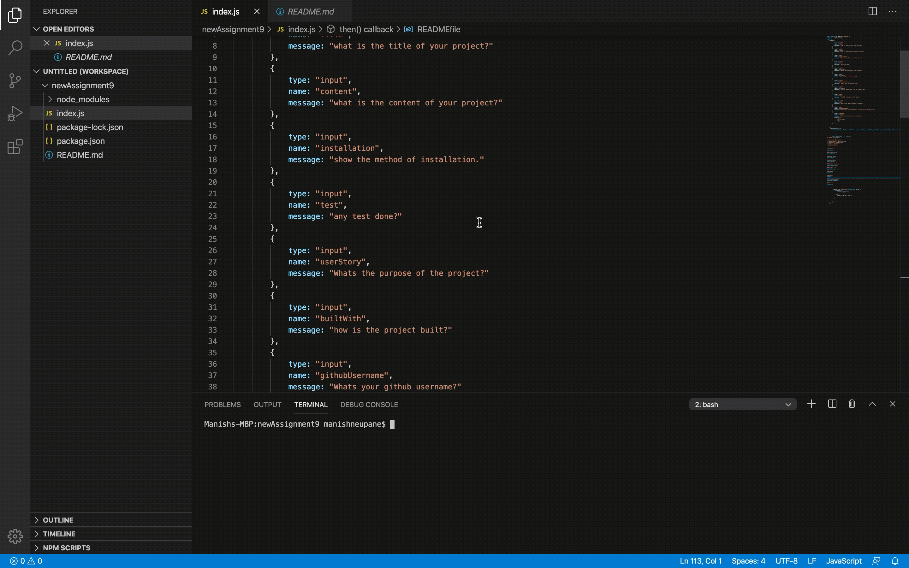

# README generator
## Table of Contents

- [content] (#content)
- [Installation] (#intallation)
- [userStory] (#userstory)
- [Author] (#author)
- [email] (#email)

 ### Content
This assignment is about writing code to run in node.js to generate the README.md.

### Installation
first run -- npm init -- than npm install inquirer

### User Story
The app is required for user who works in different projects. In day to day life when user wants to incorporate README to the project, this app is very useful. when user run the program, it prompts with series of questions and generate the README file including the answers provided to the prompts. 

### Built With
The application is built using VS Code. The code can be run in terminal using node to generate README.

# gif of app
;

### Github Username
ManNeu

### Github Link
(https://github.com/ManNeu/READMEgenerator)

### Author
Manish Neupane

### email
mrnish.are@gmail.com

### Acknowledgement
Instructors

### License
ISC
